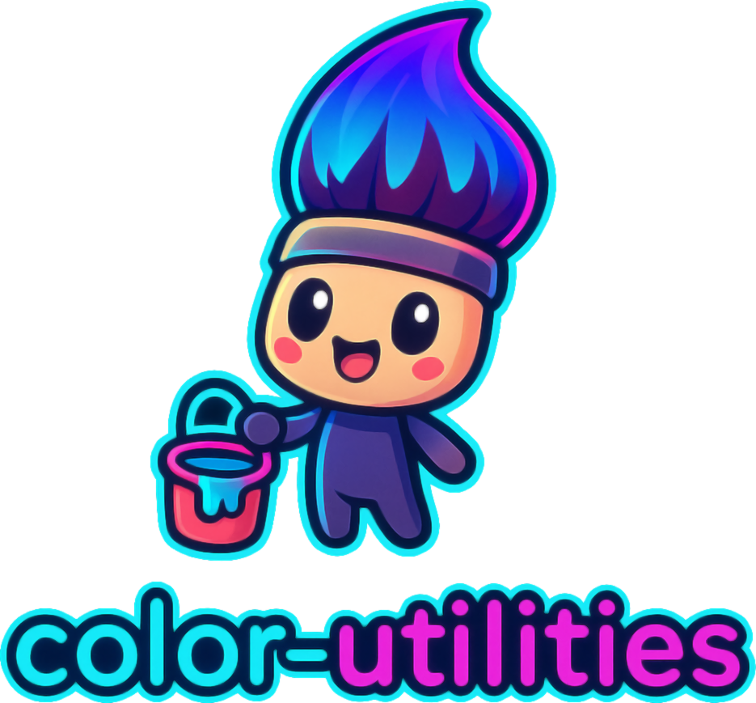

[](https://www.npmjs.com/package/@omnidyon/color-utilities)
[](https://opensource.org/licenses/ISC)
[](https://www.npmjs.com/package/@dynamize/color-utilities)
[](https://www.typescriptlang.org/)

<p align="center">
  
</p>

#### _Tools for all your color needs_

Color utilities is a collection of tools used to work with colors.

## Features

- **Color conversions (ansi16, ansi256, cmy, cmyk, tsl, hsl, hsv, lab, luv, lch xyz ...)**
- **Color blending**
- **Color harmony pallet creation**
- **Color mixers ( such as getting shades, tints and tones)**
- **Performing Chromatic adaptation**
- **Color validation and sanitization**
- **Color manipulation (lighten, darken, saturate, mix)**
- **WCAG accessibility checking**
- **CSS color string parsing and formatting**
- **Color interpolation and scales**
- **Gamut checking and mapping**

## Table of Contents

- [Color Utilities](#color-utilities)
- [Features](#features)
- [Table of Contents](#table-of-contents)
- [About Color Utilities](#about-color-utilities)
  - [Limits](#limits)
  - [Performance Considerations](#performance-considerations)
- [Documentation](#documentation)
  - [Dependencies](#dependencies)
  - [Importing](#importing)
  - [TypeScript Support](#typescript-support)
- [Color](#color)
- [Common Use Cases](#common-use-cases)
- [Conversions](#conversions)
- [Color Converter](#color-converter)
  - [RGB Converter](#rgb-converter)
  - [XYZ Converter](#xyz-converter)
- [Color Blending](#color-blending)
  - [Blender](#blender)
  - [blend](#blend)
- [Color Harmonies](#color-harmonies)
  - [Analogous](#analogous)
  - [Clash](#clash)
  - [Complementary](#complementary)
  - [Split Complementary](#split-complementary)
  - [Four Tone](#four-tone)
  - [Five Tone](#five-tone)
  - [Six Tone](#six-tone)
  - [Neutral](#neutral)
  - [Square](#square)
  - [Tetradic](#tetradic)
  - [Triadic](#triadic)
- [Color Validation & Sanitization](#color-validation)
- [Color Manipulation](#color-manipulation)
- [Accessibility Utilities](#accessibility)
- [CSS Color Utilities](#css-utilities)
- [Color Interpolation & Scales](#color-interpolation)
- [Gamut Utilities](#gamut-utilities)
- [Color Mixes](#color-mixes)
  - [Tones](#tones)
  - [Tints](#tints)
  - [Shades](#shades)
- [Chromatic adaptation](#chromatic-adaptation)
  - [Supported Illuminants](#supported-illuminants)
  - [adapt](#adapt)
  - [Adapter](#adapter)
- [Delta E / Color Difference](#delta-e)
  - [CIE 76](#cie-76)
  - [CIE 94](#cie-94)
  - [CIE 00](#cie-00)
- [Troubleshooting](#troubleshooting)
- [Contributing](#contributing)
- [License](#license)

## About Color Utilities

Color Utilities aims to be a one-stop shop for any work related to colors, mostly built with pure functions
One can use as little or as much of it as needed or wanted, avoiding unneeded project bloating.
In the future, this library will most probably grow further.

### Limits

<a name="limits"></a>
Due to the nature of color spaces, certain conversions are more computationally taxing than others.
Further, certain conversions lead to data loss like RGB to Ansi16 and then back to RGB will most probably result in a
significant difference in color.

### Performance Considerations

<a name="performance-considerations"></a>

- **Color Class**: Use with caution in performance-critical applications as it computes multiple color spaces
- **Standalone Functions**: More efficient for single conversions
- **Individual CSS Parsers**: Use specific parsers (parseHex, parseRgb) instead of fromCssString for better performance
- **"all" Option**: Avoid in real-time applications due to computational cost
- **Tree-shaking**: Individual functions can be imported separately to reduce bundle size

## Documentation

<a name="documentation"></a>

```sh
npm install --save @dynamize/color-utilities
```

### Dependencies

<a name="dependencies"></a>

This library has no dependencies and is completely self-contained.

### Importing

<a name="importing"></a>

Importing is done using the ES static import declaration.
Example:

```javascript
import { Color } from "@dynamize/color-utilities";
```

In order to use the import declaration in a source file, the file must be interpreted by the runtime as a
module.

### TypeScript Support

<a name="typescript-support"></a>

This library includes full TypeScript definitions. No additional `@types` package needed.

```typescript
import { Color, RGB } from "@dynamize/color-utilities";

const color: Color = new Color("rgb", { red: 255, green: 0, blue: 0 });
const rgb: RGB = color.data.rgb;
```

## Color

<a name="color"></a>
A Color class is a representation of a color in Color Utilities. Use case for this is when you know you will need
values for more then one color space.

Usage examples:

```javascript
import { Color } from "@dynamize/color-utilities";

const color = new Color("rgb", { red: 238, green: 200, blue: 27 });

console.log(color.data);
```

## Common Use Cases

<a name="common-use-cases"></a>

### Color Picker Implementation

```javascript
// Efficient for color pickers - only compute needed spaces
const pickerColor = new Color("hsv", { hue: 49, saturation: 86, value: 93 }, [
  "rgb",
  "hex",
]);
```

### Theme Generation

```javascript
// Generate complete color themes
const baseColor = new Color("hex", "#3498db");
const shades = getShades(baseColor.data.rgb, { size: 10, prefixed: true });
const harmony = analogousHarmony(baseColor.data.hsl, true);
```

### Color Analysis

```javascript
// Compare colors for accessibility
const contrast = deltaECIE00Rgb(textColor.rgb, backgroundColor.rgb);
```

| Param place | Description                            |     | Formats                                                                                                                                                                                                                                                                                                                                                                                                                                                                      |
| ----------- | -------------------------------------- | --- | ---------------------------------------------------------------------------------------------------------------------------------------------------------------------------------------------------------------------------------------------------------------------------------------------------------------------------------------------------------------------------------------------------------------------------------------------------------------------------- |
| 1st         | Space in which color values are passed |     | adobe_98_rgb", "apple_rgb", "ansi16", "ansi256", "best_rgb", "beta_rgb", "bruce_rgb", "cie_rgb", "color_match_rgb", "cmy", "cmyk", "don_rgb_4", "eci_rgb_v2" "etka_space_ps5", "hcy", "hex", "hsi", "hsl", "hsv", "hunter_lab", "hwb", "lab", "lch_ab", "lch_uv", "luv", "lms", "ntsc_rgb", "pal_secam_rgb", "pro_photo_rgb", "rgb", "ryb", "tsl", "smpte_c_rgb", "wide_gamut_rgb", "uvw","xvycc", "xyy", "xyz", "ycbcr_BT601", "yccbccrc", "ycocg", "ydbdr", "yiq", "ypbpr" |
| 2nd         | Color values                           |     | number, string, or color data object                                                                                                                                                                                                                                                                                                                                                                                                                                         |
| 3rd         | optional - colors spaces to compute    |     | string [] of "all"                                                                                                                                                                                                                                                                                                                                                                                                                                                           |

- The first argument we pass is a string value and it represents the space in which color values will be passed.
- The second argument is the actual color values and it's passed in form of an object.
- The third argument is optional and has a form of string array or a string "all", if not passed, automatically
  values for hex, hvs, lab, and cmyk, will be computed, alternatively color spaces listed in the array will be
  computed.

The result of the above example is:

```javascript
 Color {
  rgb: { red: 238, green: 200, blue: 27, inGamut: true },
  xyz: { x: 56.11537464609447, y: 59.56827248834963, z: 9.578873171265526 },
  hex: 'EEC81B',
  hsv: { hue: 49, saturation: 89, value: 93 },
  lab: {
    luminance: 81.60296053275202,
    a: -1.2482727232548951,
    b: 79.33052440955292
 },
 cmyk: {
   cyan: 0,
   magenta: 15.96638655462185,
   yellow: 88.65546218487395,
   key: 6.666666666666665
  }
 }
```

Lets see an alternative use:

```javascript
import { Color } from "@dynamize/color-utilities";

const color = new Color("rgb", { red: 238, green: 200, blue: 27 }, [
  "hsl",
  "luv",
  "ryb",
  "tsl",
]);

console.log(color.data);
```

Result from the above example would be:

```javascript
Color {
  rgb: { red: 238, green: 200, blue: 27, inGamut: true },
  xyz: { x: 56.11537464609447, y: 59.56827248834963, z: 9.578873171265526 },
  hsl: { hue: 49, saturation: 86, lightness: 52 },
  luv: { L: 81.60296053275202, u: 33.50413039331645, v: 84.4716716630059 },
  ryb: { red: 63.346820809248555, yellow: 228, blue: 17 },
  tsl: {
    tint: 0.4209301051592921,
    saturation: 0.27240784750042124,
    lightness: 0.7515294117647058
  }
}
```

Note:
If you noticed RGB and XYZ values are returned regardless, they are needed for two main family of spaces and
there for are computed by default.

If "all" is passed as a third argument, all 45 spaces will be computed (the return example is to big to show here),
this option is computationally tasking and it's not a good option for color pickers or other use cases where there
is a high frequency of re computation. Accidentally the default (no third argument) will return values utilized in
a Photoshop color picker (rgb, hsv, lab, cmyk and hex).

## Conversions

<a name="conversions"></a>

Here is a list of all color conversion methods, they are standalone, and can be utilized on their own.
Some of them might have multiple conversions and that will be stated in the table.

| Name                | Description                                          | Conversions              | Notes              | Parameter                                                      |
| ------------------- | ---------------------------------------------------- | ------------------------ | ------------------ | -------------------------------------------------------------- |
| ansi16ToRgb         | Converts an Ansi16 numeric value to sRGB values      | Ansi16 to sRGB           | Possible data loss | number                                                         |
| ansi256ToRGB        | Converts an Ansi256 numeric value ro sRGB values     | Ansi256 to sRGB          | Possible data loss | number                                                         |
| cmyToSRgb           | Converts colors CMY values in to sRGB values         | CYM to sRGB              | No major data loss | { cyan: number, magenta: number, yellow: number}               |
| cmykToRgb           | Converts colors CMYK values in to sRGB values        | CMYK to sRGB             | No major data loss | { cyan: number, magenta: number, yellow: number, key: number } |
| hclToLab            | Converts colors HCL values in to CIE-L\*ab values    | HCL to LAB               | No major data loss | { luminance: number, hue: number, chroma: number }             |
| hcyToSrgb           | Converts colors HCY values in to sRGB values         | HCY to sRGB              | No major data loss | { hue: number, chroma: number, Yluminance: number }            |
| hexToRgb            | Converts a HEX string value in to sRGB values        | HEX to sRGB              | No major data loss | string                                                         |
| hextToInt           | Converts a Hex string value in to a integer value    | HEX to Integer           |                    | string                                                         |
| hexToDecimal        | Converts a Hex string value in to a decimal value    | HEX to Decimal           |                    | string                                                         |
| hsiToSrgb           | Converts a colors HSI values in to sRGB values       | HSI to sRGB              | No major data loss | { hue: number, saturation: number, intensity: number }         |
| hslToToHex          | Converts a colors HSL values in to a HEX string      | HSL to HEX               | No major data loss | { hue: number, saturation: number, lightness: number }         |
| hslToHsv            | Converts a colors HSL values in to HSV values        | HSL to HSV               | No major data loss | { hue: number, saturation: number, lightness: number }         |
| hslToRgb            | Converts a colors HSL values in to sRGB values       | HSL to sRGB              | No major data loss | { hue: number, saturation: number, lightness: number }         |
| hsvToAnsi16         | Converts a colors HSV values in to Ansi16 numeric    | HSV to Ansi16            | Possible data loss | { hue: number, saturation: number, value: number }             |
| hsvToHsl            | Converts a colors HSV values in to HSL values        | HSV to HSL               | No major data loss | { hue: number, saturation: number, value: number }             |
| hsvToRgb            | Converts a colors HSV values in to sRGB values       | HSV to sRGB              | No major data loss | { hue: number, saturation: number, value: number }             |
| hwbToRgb            | Converts a colors HWB values in to sRGB values       | HWB to sRGB              | No major data loss | { hue: number, whiteness: number, blackness: number }          |
| labToLch_ab         | Converts a colors CIE-L\*ab values in to LCH(ab)     | LAB to LCH               | No major data loss | { luminance: number, a: number, b: number }                    |
| labToSrgb           | Converts a colors CIE-L\*ab values in to sRgb        | LAB to XYZ to sRGB       | No major data loss | { luminance: number, a: number, b: number }                    |
| labToXyz            | Converts a colors CIE-L\*ab values in to XYZ         | LAB to XYZ               | No major data loss | { luminance: number, a: number, b: number }                    |
| hunterLabToXyz      | Converts a colors Hunter's Lab values in to XYZ      | LAB to XYZ               | No major data loss | { luminance: number, a: number, b: number }                    |
| lch_abToLab         | Converts a colors LCH(ab) values in to CIE-L\*ab     | LCH to LAB               | No major data loss | { lightness: number, chroma: number, hue: number }             |
| lch_abToXyz         | Converts a colors LCH(ab) values in to XYZ           | LCH to XYZ               | No major data loss | { lightness: number, chroma: number, hue: number }             |
| lch_uvToLuv         | Converts a colors LCH(uv) values in to LUV           | LCH to LUV               | No major data loss | { lightness: number, chroma: number, hue: number }             |
| lch_uvToXyz         | Converts a colors LCH(uv) values in to XYZ           | LCH to XYZ               | No major data loss | { lightness: number, chroma: number, hue: number }             |
| lmsToXyz            | Converts a colors LMS values in to XYZ values        | LMS to XYZ               | No major data loss | { long: number, medium: number, short: number }                |
| luvToLch_uv         | Converts a colors LUV values to LCH(uv) values       | LUV to LCH               | No major data loss | { L: number, u: number, v: number }                            |
| luvToXyz            | Converts a colors LUV values to XYZ values           | LUV to XYZ               | No major data loss | { L: number, u: number, v: number }                            |
| oKLCHToOKLab        | Converts a colors OKLCH values to LAB values         | OKLCH to RGB             | No major data loss | { luminance: number, a: number, b: number }                    |
| oKLCHToSRGB         | Converts a colors OKLCH values to sRGB values        | OKLCH to LMS to RGB      | No major data loss | { red: number, green: number, blue: number }                   |
| sRgbToAdobeRgb      | Converts a colors sRGB values in to Adobe 98 RGB     | RGB to XYZ to RGB        | No major data loss | { red: number, green: number, blue: number }                   |
| sRgbToAppleRgb      | Converts a colors sRGB values in to Apple RGB        | RGB to XYZ to RGB        | No major data loss | { red: number, green: number, blue: number }                   |
| sRgbToBestRgb       | Converts a colors sRGB values in to Best RGB         | RGB to XYZ to RGB        | No major data loss | { red: number, green: number, blue: number }                   |
| sRgbToBetaRgb       | Converts a colors sRGB values in to Beta RGB         | RGB to XYZ to RGB        | No major data loss | { red: number, green: number, blue: number }                   |
| sRgbToBruceRgb      | Converts a colors sRGB values in to Bruce RGB        | RGB to XYZ to RGB        | No major data loss | { red: number, green: number, blue: number }                   |
| sRgbToCieRgb        | Converts a colors sRGB values in to CIE RGB          | RGB to XYZ to RGB        | No major data loss | { red: number, green: number, blue: number }                   |
| sRgbToColorMatchRgb | Converts a colors sRGB values in to Color Match RGB  | RGB to XYZ to RGB        | No major data loss | { red: number, green: number, blue: number }                   |
| sRgbToDonRgb4       | Converts a colors sRGB values in to DON RGB 4        | RGB to XYZ to RGB        | No major data loss | { red: number, green: number, blue: number }                   |
| sRgbToEtkaSpacePs5  | Converts a colors sRGB values in to Etka Space ps5   | RGB to XYZ to RGB        | No major data loss | { red: number, green: number, blue: number }                   |
| sRgbToNtscRgb       | Converts a colors sRGB values in to NTSC RGB         | RGB to XYZ to RGB        | No major data loss | { red: number, green: number, blue: number }                   |
| sRgbToPalSecamRgb   | Converts a colors sRGB values in to PAL/SECAM RGB    | RGB to XYZ to RGB        | No major data loss | { red: number, green: number, blue: number }                   |
| sRgbToProPhotoRgb   | Converts a colors sRGB values in to PRO PHOTO RGB    | RGB to XYZ to RGB        | No major data loss | { red: number, green: number, blue: number }                   |
| sRgbToSmpteCRgb     | Converts a colors sRGB values in to SMPTE-C RGB      | RGB to XYZ to RGB        | No major data loss | { red: number, green: number, blue: number }                   |
| sRgbToWideGamutRgb  | Converts a colors sRGB values in to Wide Gamut RGB   | RGB to XYZ to RGB        | No major data loss | { red: number, green: number, blue: number }                   |
| sRgbToEciRgbV2      | Converts a colors sRGB values in to ECI RGB V2       | RGB to XYZ to RGB        | No major data loss | { red: number, green: number, blue: number }                   |
| sRgbToAnsi16        | Converts a colors sRGB values in to Ansi16 numeric   | RGB to Ansi16            | Possible data loss | { red: number, green: number, blue: number }                   |
| sRgbToAnsi256       | Converts a colors sRGB values in to Ansi256 numeric  | RGB to Ansi256           | Possible data loss | { red: number, green: number, blue: number }                   |
| sRgbToCmy           | Converts a colors sRGB values in to CMY values       | RGB to CMY               | No major data loss | { red: number, green: number, blue: number }                   |
| sRgbToCmyk          | Converts a colors sRGB values in to CMYK values      | RGB to CMYK              | No major data loss | { red: number, green: number, blue: number }                   |
| sRgbToHcy           | Converts a colors sRGB values in to HCY values       | RGB to HCY               | No major data loss | { red: number, green: number, blue: number }                   |
| sRgbToHex           | Converts a colors sRGB values in to a HEX string     | RGB to HEX               | No major data loss | { red: number, green: number, blue: number }                   |
| sRgbaToHex          | Converts a colors sRGBA values in to a HEX string    | RGBA to HEX              | No major data loss | { red: number, green: number, blue: number }                   |
| sRgbToHsi           | Converts a colors sRGB values in to HSI values       | RGB to HSI               | No major data loss | { red: number, green: number, blue: number }                   |
| sRgbToHsl           | Converts a colors sRGB values in to HSL values       | RGB to HSL               | No major data loss | { red: number, green: number, blue: number }                   |
| sRgbToHsv           | Converts a colors sRGB values in to HSV values       | RGB to HSV               | No major data loss | { red: number, green: number, blue: number }                   |
| sRgbToHwg           | Converts a colors sRGB values in to HSV values       | RGB to HWG               | No major data loss | { red: number, green: number, blue: number }                   |
| sRgbToLab           | Converts a colors sRGB values in to CIE-L\*ab values | RGB to XYZ to LAB        | No major data loss | { red: number, green: number, blue: number }                   |
| sRgbToLch_ab        | Converts a colors sRGB values in to LCH(ab) values   | RGB to XYZ to LAB to LCH | No major data loss | { red: number, green: number, blue: number }                   |
| sRgbToLch_uv        | Converts a colors sRGB values in to LCH(uv) values   | RGB to XYZ to LUV to LCH | No major data loss | { red: number, green: number, blue: number }                   |
| sRgbToLuv           | Converts a colors sRGB values in to LUV values       | RGB to XYZ to LUV        | No major data loss | { red: number, green: number, blue: number }                   |
| sRgbToRyb           | Converts a colors sRGB values in to RYB values       | RGB to RYB               | No major data loss | { red: number, green: number, blue: number }                   |
| sRGBToOKLCH         | Converts a colors sRGB values in to OKLch values     | RGB to LMS to LAB to LCH | No major data loss | { red: number, green: number, blue: number }                   |
| sRgbToTsl           | Converts a colors sRGB values in to TSL values       | RGB to TSL               | No major data loss | { red: number, green: number, blue: number }                   |
| sRgbToUvq           | Converts a colors sRGB values in to UVW values       | RGB to XYZ to UVW        | No major data loss | { red: number, green: number, blue: number }                   |
| sRgbToYCbCrBT601    | Converts a colors sRGB values in to Y′CbCr (YUV)     | RGB to YCbCr             | No major data loss | { red: number, green: number, blue: number }                   |
| sRgbToYCbCrBT709    | Converts a colors sRGB values in to Y′CbCr BT.709    | RGB to YCbCr             | No major data loss | { red: number, green: number, blue: number }                   |
| sRgbToYDbDr         | Converts a colors sRGB values in to YDbDr values     | RGB to YDbDr             | No major data loss | { red: number, green: number, blue: number }                   |
| sRgbToYPbPr         | Converts a colors sRGB values in to YPbPr values     | RGB to YPbPr             | No major data loss | { red: number, green: number, blue: number }                   |
| sRgbToYcCbcCrc      | Converts a colors sRGB values in to YcCbcCrc values  | RGB to YcCbcCrc          | No major data loss | { red: number, green: number, blue: number }                   |
| sRgbToYCgCo         | Converts a colors sRGB values in to YCoCg values     | RGB to YCoCg             | No major data loss | { red: number, green: number, blue: number }                   |
| sRgbToYiq           | Converts a colors sRGB values in to YIQ values       | RGB to YIQ               | No major data loss | { red: number, green: number, blue: number }                   |
| sRgbToXvYcc         | Converts a colors sRGB values in to xvYCC values     | RGB to xvYCC             | No major data loss | { red: number, green: number, blue: number }                   |
| sRgbToXyz           | Converts a colors sRGB values in to XYZ values       | RGB to XYZ               | No major data loss | { red: number, green: number, blue: number }                   |
| adobeRgbToXyz       | Converts a colors Adobe 98 values in to XYZ values   | RGB to XYZ               | No major data loss | { red: number, green: number, blue: number }                   |
| appleRgbToXyz       | Converts a colors Apple RGB values in to XYZ values  | RGB to XYZ               | No major data loss | { red: number, green: number, blue: number }                   |
| bestRgbToXyz        | Converts a colors Best RGB values in to XYZ values   | RGB to XYZ               | No major data loss | { red: number, green: number, blue: number }                   |
| betaRgbToXyz        | Converts a colors Beta RGB values in to XYZ values   | RGB to XYZ               | No major data loss | { red: number, green: number, blue: number }                   |
| bruceRgbToXyz       | Converts a colors Bruce RGB values in to XYZ values  | RGB to XYZ               | No major data loss | { red: number, green: number, blue: number }                   |
| cieRgbToXyz         | Converts a colors CIE RGB values in to XYZ values    | RGB to XYZ               | No major data loss | { red: number, green: number, blue: number }                   |
| colorMatchRgbToXyz  | Converts a colors COLOR MATCH RGB values in to XYZ   | RGB to XYZ               | No major data loss | { red: number, green: number, blue: number }                   |
| donRgb4ToXyz        | Converts a colors DON RGB 4 values in to XYZ values  | RGB to XYZ               | No major data loss | { red: number, green: number, blue: number }                   |
| etkaSpacePs5ToXyz   | Converts a colors ETKA SPACE PS5 values in to XYZ    | RGB to XYZ               | No major data loss | { red: number, green: number, blue: number }                   |
| ntscRgbToXyz        | Converts a colors NTSC RGB values in to XYZ values   | RGB to XYZ               | No major data loss | { red: number, green: number, blue: number }                   |
| palSecamRgbToXyz    | Converts a colors PAL/SECAM RGB values in to XYZ     | RGB to XYZ               | No major data loss | { red: number, green: number, blue: number }                   |
| proPhotoRgbToXyz    | Converts a colors PRO PHOTO RGB values in to XYZ     | RGB to XYZ               | No major data loss | { red: number, green: number, blue: number }                   |
| smpteCRgbToXyz      | Converts a colors SMPTE-C RGB values in to XYZ       | RGB to XYZ               | No major data loss | { red: number, green: number, blue: number }                   |
| wideGamutRgbToXyz   | Converts a colors WIDE GAMUT RGB values in to XYZ    | RGB to XYZ               | No major data loss | { red: number, green: number, blue: number }                   |
| eciRgbV2ToXyz       | Converts a colors ECI RGB V2 values in to XYZ        | RGB to XYZ               | No major data loss | { red: number, green: number, blue: number }                   |
| rybToSrgb           | Converts a colors RYB values to a sRGB values        | RYB to RGB               | No major data loss | { red: number, green: number, blue: number }                   |
| tslToSrgb           | Converts a colors TSL values to a sRGB values        | TSL to RGB               | No major data loss | { red: number, green: number, blue: number }                   |
| uvwToXyz            | Converts a colors UVW values to a XYZ values         | UVW to XYZ               | No major data loss | { u: number, v: number, w: number }                            |
| xvYccToYcbcrBT601   | Converts a colors xvYCC values to Y′CbCr (YUV)       | xvYCC to YCbCr           | No major data loss | { Y: number, Cb: number, Cr: number }                          |
| xvYccToSrgb         | Converts a colors xvYCC values to a SRGB values      | xvYCC to YCbCr to sRGB   | No major data loss | { Y: number, Cb: number, Cr: number }                          |
| xyYToXyz            | Converts colors xyY values to XYZ values             | XYY to XYZ               | No major data loss | { x: number, y: number, Y: number }                            |
| xyzToAdobeRgb       | Converts colors XYZ values to Adobe 98 values        | XYZ to RGB               | No major data loss | { x: number, y: number, z: number }                            |
| xyzToAppleRgb       | Converts colors XYZ values to Apple RGB values       | XYZ to RGB               | No major data loss | { x: number, y: number, z: number }                            |
| xyzToBestRgb        | Converts colors XYZ values to Best RGB values        | XYZ to RGB               | No major data loss | { x: number, y: number, z: number }                            |
| xyzToBetaRgb        | Converts colors XYZ values to Beta RGB values        | XYZ to RGB               | No major data loss | { x: number, y: number, z: number }                            |
| xyzToBruceRgb       | Converts colors XYZ values to Bruce RGB values       | XYZ to RGB               | No major data loss | { x: number, y: number, z: number }                            |
| xyzToCieRgb         | Converts colors XYZ values to CIE RGB values         | XYZ to RGB               | No major data loss | { x: number, y: number, z: number }                            |
| xyzToColorMatchRgb  | Converts colors XYZ values to COLOR MATCH RGB        | XYZ to RGB               | No major data loss | { x: number, y: number, z: number }                            |
| xyzToDonRgb4        | Converts colors XYZ values to DON RGB 4 values       | XYZ to RGB               | No major data loss | { x: number, y: number, z: number }                            |
| xyzToEtkaSpacePs5   | Converts colors XYZ values to ETKA SPACE PS5 values  | XYZ to RGB               | No major data loss | { x: number, y: number, z: number }                            |
| xyzToNtscRgb        | Converts colors XYZ values to NTSC RGB values        | XYZ to RGB               | No major data loss | { x: number, y: number, z: number }                            |
| xyzToPalSecamRgb    | Converts colors XYZ values to PAL/SECAM RGB values   | XYZ to RGB               | No major data loss | { x: number, y: number, z: number }                            |
| xyzToProPhotoRgb    | Converts colors XYZ values to PRO PHOTO RGB values   | XYZ to RGB               | No major data loss | { x: number, y: number, z: number }                            |
| xyzToSmpteCRgb      | Converts colors XYZ values to SMPTE-C RGB values     | XYZ to RGB               | No major data loss | { x: number, y: number, z: number }                            |
| xyzToWideGamutRgb   | Converts colors XYZ values to WIDE GAMUT RGB values  | XYZ to RGB               | No major data loss | { x: number, y: number, z: number }                            |
| xyzToEciRgbV2       | Converts colors XYZ values to ECI RGB V2 values      | XYZ to RGB               | No major data loss | { x: number, y: number, z: number }                            |
| xyzToLab            | Converts colors XYZ values to CIE-L\*ab values       | XYZ to LAB               | No major data loss | { x: number, y: number, z: number }                            |
| xyzToLuv            | Converts colors XYZ values to LUV values             | XYZ to LUV               | No major data loss | { x: number, y: number, z: number }                            |
| xyzToLch_uv         | Converts colors XYZ values to LCH(uv) values         | XYZ to LCH               | No major data loss | { x: number, y: number, z: number }                            |
| xyzToUvw            | Converts colors XYZ values to UVW values             | XYZ to UVW               | No major data loss | { x: number, y: number, z: number }                            |
| xyzToSrgb           | Converts colors XYZ values to sRGB values            | XYZ to RGB               | No major data loss | { x: number, y: number, z: number }                            |
| xyzToLms            | Converts colors XYZ values to LMS values             | XYZ to LMS               | No major data loss | { x: number, y: number, z: number }                            |
| xyzToHunterLab      | Converts colors XYZ values to Hunter's Lab values    | XYZ to LAB               | No major data loss | { x: number, y: number, z: number }                            |
| xyzToXyY            | Converts colors XYZ values to XYY values             | XYZ to XYY               | No major data loss | { x: number, y: number, z: number }                            |
| yCbCrBT601ToSrgb    | Converts colors Y′CbCr (YUV) values to sRGB values   | YCbCr to RGB             | No major data loss | { Y: number, Cb: number, Cr: number }                          |
| yCbCrBT601ToXvYcc   | Converts colors Y′CbCr (YUV) values to xvYCC values  | YCbCr to xvYCC           | No major data loss | { Y: number, Cb: number, Cr: number }                          |
| yCbCrBT601ToYPbPr   | Converts colors Y′CbCr (YUV) values to YPbPr values  | YCbCr to YPbPr           | No major data loss | { Y: number, Cb: number, Cr: number }                          |
| yCbCrBT709ToSrgb    | Converts colors Y′CbCr BT.709 values to sRGB values  | YCbCr to RGB             | No major data loss | { Y: number, Cb: number, Cr: number }                          |
| ycCbcCrcToSrgb      | Converts colors YcCbcCrc values to sRGB values       | YcCbcCrc to RGB          | No major data loss | { Yc: number, Cbc: number, Crc: number }                       |
| yCgCoToSrgb         | Converts colors YCoCg values to sRGB values          | YCoCg to RGB             | No major data loss | { Y: number, Co: number, Cg: number }                          |
| yDbDrToSrgb         | Converts colors YDbDr values to sRGB values          | YDbDr to RGB             | No major data loss | { Y: number, Co: number, Cg: number }                          |
| yiqToSrgb           | Converts colors YIQ values to sRGB values            | YIQ to RGB               | No major data loss | { Y: number, Co: number, Cg: number }                          |
| yPbPrToSrgb         | Converts colors YPbPr values to sRGB values          | YPbPr to RGB             | No major data loss | { Y: number, Co: number, Cg: number }                          |
| yPbPrToYCbCr        | Converts colors YPbPr values to YCbCr values         | YPbPr to YCbCr           | No major data loss | { Y: number, Co: number, Cg: number }                          |

## Color Converter

<a name="color_converter"></a>

In situations where you might need to covert from one space into multiple spaces, you can use a color converter.
Color Converter is faster and less task-intensive than using Color. There are two prebuilt Color Converters,
RGB Converter and the XYZ Converter.

### RGB Converter

<a name="rgb_converter"></a>

RGB Converter is a prebuilt Color Converter that takes a single attribute of a type:
{ red: number, green: number, blue: number } or { r: number, g: number, b: number }.

It has a single method, "get" and it takes an attribute of type string which represents a color space you would like back.
Supported conversion are:
adobe_98_rgb,
apple_rgb,
ansi16,
ansi256,
best_rgb,
beta_rgb,
bruce_rgb,
cie_rgb,
color_match_rgb,
cmy,
cmyk,
don_rgb_4,
etka_space_ps5,
eci_rgb_v2,
hcy,
hex,
hsi,
hsl,
hsv,
hwb,
lab,
lch_ab,
lch_uv,
luv,
ntsc_rgb,
pal_secam_rgb,
pro_photo_rgb,
ryb,
smpte_c_rgb,
tsl,
uvw,
wide_gamut_rgb,
ycbcr_BT601,
ycbcr_BT709,
ycbcr_BT2020,
ydbdr,
ypbpr,
yccbccrc,
ycocg,
yiq,
xvycc,
xyz.

Usage example:

```javascript
import { RgbConverter } from "@dynamize/color-utilities";

const rgbCon = new RgbConverter({ red: 238, green: 200, blue: 27 });

console.log(rgbCon.get("hsv"));
```

This will return HSV values for the above-given color.

### XYZ Converter

<a name="xyz-converter"></a>

XYZ Converter is a prebuilt Color Converter that takes a single attribute of a type:
{ x: number, y: number, z: number }.

It has a single method, "get" and it takes an attribute of type string which represents a color space you would like back.
Supported conversion are:
lab,
lch_ab,
lch_uv,
luv,
uvw,
rgb,
adobe_98_rgb,
apple_rgb,
best_rgb,
beta_rgb,
bruce_rgb,
cie_rgb,
color_match_rgb,
don_rgb_4,
etka_space_ps5,
eci_rgb_v2,
ntsc_rgb,
pal_secam_rgb,
pro_photo_rgb,
smpte_c_rgb,
wide_gamut_rgb,
xyy,
lms,
hunters_lab.

Usage example:

```javascript
import { XyzConverter } from "@dynamize/color-utilities";

const xyzCon = new XyzConverter({ red: 238, green: 200, blue: 27 });

console.log(xyzCon.get("luv"));
```

This will return LUV values for the above-given color.

## Color Blending

<a name="color-blending"></a>
In Color Utilities, there are two ways you can blend colors: either by using the standalone method "blend" or by using a Color Blender.

### Blender

<a name="blender"></a>
Color Blender is quite powerful, it allows you to blend two colors in rgb ,cmyk, hex, hsl ,hsv, hwb, hex, ryb and xyz formats.
The two colors do not have to be in the same format to blend them, and the returned color can have any of the following formats:
rgb ,cmyk, hex, hsl ,hsv, hwb, hex, ryb, xyz.

Usage example:

```javascript
import { Blender } from "@dynamize/color-utilities";

const color = new Blender(
  { c: 0, m: 7, y: 100, k: 0 },
  { h: 0, s: 100, v: 100 },
  { weight: 0.67, returnType: "hex" }
);

console.log(color.color);
```

Color Blender can return two things: color or blend data. Color will just be a color value in the format that was requested, blend data will give you more information. Below, you can see the blend data for the above example:

```javascript
{
    color1: {
      data: { cyan: 0, magenta: 7, yellow: 100, key: 0 },
      rgb: { red: 255, green: 237.14999999999998, blue: 0, inGamut: true },
      amount: 0.67,
    },
    color2: {
      data: { hue: 0, saturation: 100, value: 100 },
      rgb: { red: 255, green: 0, blue: 0, inGamut: true },
      amount: 0.32999999999999996,
    },
    resultColor: "FF9F00",
  }
```

### blend

<a name="blend"></a>
Using the blend method is pretty straight-forward. It takes three parameters, the first two being the RGB values of colors to blend, and the
last one is a percentage of the first color, the remaining percentage will be allocated to the second one.

Usage example:

```javascript
import { blend } from "@dynamize/color-utilities";

const blended = blend(
  { red: 255, green: 237, blue: 0 },
  { red: 255, green: 0, blue: 0 },
  0.67
);

console.log(blended);
```

## Color Harmonies

<a name="color-harmonies"></a>

With Color utilities, you can also generate a number of Harmony pallets.
For more information about Harmonies, visit: https://simplified.com/blog/colors/color-harmony
All Harmonies are a standalone functions and they all the a color in a HSL format ({ hue: number, saturation: number, lightness: number }) and return an array of hex values. In addition, in addition the second optional parameter is a boolean, which represents if returned hex values should start with a #.

### Analogous

<a name="analogous"></a>

Usage example:

```javascript
import { analogousHarmony } from "@dynamize/color-utilities";

const pallet = analogousHarmony(
  { hue: 49, saturation: 86, lightness: 52 },
  true
);

console.log(pallet);
```

### Clash

<a name="clash"></a>

Usage example:

```javascript
import { clashHarmony } from "@dynamize/color-utilities";

const pallet = clashHarmony({ hue: 49, saturation: 86, lightness: 52 }, true);

console.log(pallet);
```

### Complementary

<a name="complementary"></a>

Usage example:

```javascript
import { complementaryHarmony } from "@dynamize/color-utilities";

const pallet = complementaryHarmony(
  { hue: 49, saturation: 86, lightness: 52 },
  true
);

console.log(pallet);
```

### Split Complementary

<a name="split-complementary"></a>

Usage example:

```javascript
import { splitComplementaryHarmony } from "@dynamize/color-utilities";

const pallet = splitComplementaryHarmony(
  { hue: 49, saturation: 86, lightness: 52 },
  true
);

console.log(pallet);
```

Usage example:

```javascript
import { splitComplementaryCWHarmony } from "@dynamize/color-utilities";

const pallet = splitComplementaryCWHarmony(
  { hue: 49, saturation: 86, lightness: 52 },
  true
);

console.log(pallet);
```

Usage example:

```javascript
import { splitComplementaryCCWHarmony } from "@dynamize/color-utilities";

const pallet = splitComplementaryCCWHarmony(
  { hue: 49, saturation: 86, lightness: 52 },
  true
);

console.log(pallet);
```

### Four Tone

<a name="four-tone"></a>

Usage example:

```javascript
import { fourToneCWHarmony } from "@dynamize/color-utilities";

const pallet = fourToneCWHarmony(
  { hue: 49, saturation: 86, lightness: 52 },
  true
);

console.log(pallet);
```

Usage example:

```javascript
import { fourToneCCWHarmony } from "@dynamize/color-utilities";

const pallet = fourToneCCWHarmony(
  { hue: 49, saturation: 86, lightness: 52 },
  true
);

console.log(pallet);
```

### Five Tone

<a name="five-tone"></a>

Usage example:

```javascript
import { fiveToneAHarmony } from "@dynamize/color-utilities";

const pallet = fiveToneAHarmony(
  { hue: 49, saturation: 86, lightness: 52 },
  true
);

console.log(pallet);
```

Usage example:

```javascript
import { fiveToneBHarmony } from "@dynamize/color-utilities";

const pallet = fiveToneBHarmony(
  { hue: 49, saturation: 86, lightness: 52 },
  true
);

console.log(pallet);
```

Usage example:

```javascript
import { fiveToneCHarmony } from "@dynamize/color-utilities";

const pallet = fiveToneCHarmony(
  { hue: 49, saturation: 86, lightness: 52 },
  true
);

console.log(pallet);
```

Usage example:

```javascript
import { fiveToneDHarmony } from "@dynamize/color-utilities";

const pallet = fiveToneDHarmony(
  { hue: 49, saturation: 86, lightness: 52 },
  true
);

console.log(pallet);
```

Usage example:

```javascript
import { fiveToneEHarmony } from "@dynamize/color-utilities";

const pallet = fiveToneEHarmony(
  { hue: 49, saturation: 86, lightness: 52 },
  true
);

console.log(pallet);
```

### Six Tone

<a name="six-tone"></a>

Usage example:

```javascript
import { sixToneCWHarmony } from "@dynamize/color-utilities";

const pallet = sixToneCWHarmony(
  { hue: 49, saturation: 86, lightness: 52 },
  true
);

console.log(pallet);
```

Usage example:

```javascript
import { sixToneCCWHarmony } from "@dynamize/color-utilities";

const pallet = sixToneCCWHarmony(
  { hue: 49, saturation: 86, lightness: 52 },
  true
);

console.log(pallet);
```

### Neutral

<a name="neutral"></a>

Usage example:

```javascript
import { neutralHarmony } from "@dynamize/color-utilities";

const pallet = neutralHarmony({ hue: 49, saturation: 86, lightness: 52 }, true);

console.log(pallet);
```

### Square

<a name="square"></a>

```javascript
import { squareHarmony } from "@dynamize/color-utilities";

const pallet = squareHarmony({ hue: 49, saturation: 86, lightness: 52 }, true);

console.log(pallet);
```

### Tetradic

<a name="tetradic"></a>

```javascript
import { tetradicHarmony } from "@dynamize/color-utilities";

const pallet = tetradicHarmony(
  { hue: 49, saturation: 86, lightness: 52 },
  true
);

console.log(pallet);
```

### Triadic

<a name="triadic"></a>

```javascript
import { triadicHarmony } from "@dynamize/color-utilities";

const pallet = triadicHarmony({ hue: 49, saturation: 86, lightness: 52 }, true);

console.log(pallet);
```

## Color Validation & Sanitization

<a name="color-validation"></a>

### isValidColor

```javascript
import { isValidColor } from "@dynamize/color-utilities";

// Check if color is valid for a space
isValidColor("rgb", { red: 255, green: 0, blue: 0 }); // true
isValidColor("hsl", { hue: 400, saturation: 150, lightness: 50 }); // false
```

### sanitizeColor

```javascript
import { sanitizeColor } from "@dynamize/color-utilities";

// Clamp values to valid ranges
sanitizeColor("rgb", { red: 300, green: -5, blue: 128 });
// Returns: { red: 255, green: 0, blue: 128 }
```

## Color Manipulation

<a name="color-manipulation"></a>

```javascript
import { lighten, darken, saturate, mix } from "@dynamize/color-utilities";

const baseColor = { red: 238, green: 200, blue: 27 };

// Basic adjustments
const lighter = lighten(baseColor, 20);
const darker = darken(baseColor, 15);
const saturated = saturate(baseColor, 30);

// Color mixing
const mixed = mix(baseColor, { red: 255, green: 0, blue: 0 }, 0.5);
```
## Accessibility Utilities
<a name="accessibility"></a>

```javascript
import { contrastRatio, isAccessible } from "@dynamize/color-utilities";

// Check contrast ratio
const ratio = contrastRatio(white, black); // ~21:1

// Verify WCAG compliance
const accessible = isAccessible(
  { red: 255, green: 255, blue: 255 }, // text
  { red: 0, green: 100, blue: 200 },   // background
  'AA' // WCAG level
);
```

## CSS Color Utilities
<a name="css-utilities"></a>

```javascript
import { toCssString, fromCssString, parseHex, parseRgb } from "@dynamize/color-utilities";

// Convert to CSS strings
toCssString(color, 'hex');   // "#EEC81B"
toCssString(color, 'rgb');   // "rgb(238 200 27)"
toCssString(color, 'hsl');   // "hsl(49 86% 52%)"
toCssString(color, 'oklch'); // "oklch(0.823 0.156 89.6)"

// Parse CSS strings
fromCssString('#EEC81B');
fromCssString('rgb(238 200 27)');
fromCssString('hsl(49 86% 52%)');

// Or use individual parsers
parseHex('#EEC81B');
parseRgb('rgb(238, 200, 27)');
```
## Color Interpolation & Scales
<a name="color-interpolation"></a>

```javascript
import { interpolate, createScale } from "@dynamize/color-utilities";

// Interpolate between colors
const purple = interpolate(red, blue, 0.5, 'lab');

// Create color scales
const gradient = createScale([red, green, blue], 10, 'hsl');
```

## Gamut Utilities
<a name="gamut-utilities"></a>

```javascript
import { isInGamut, mapToGamut } from "@dynamize/color-utilities";

// Check if color is in sRGB gamut
isInGamut({ red: 300, green: -5, blue: 128 }); // false

// Map to nearest in-gamut color
mapToGamut({ red: 300, green: -5, blue: 128 });
// Returns: { red: 255, green: 0, blue: 128, inGamut: true }
```

## Color Mixes

<a name="color-mixes"></a>

Color Utilities also provides three types of color mixes you can get: Shades, Tints and Tones.
All of these are generated by a standalone function that receives two arguments, the first being a base color in RGB format, and the second one is an optional options object that can have two values: size (number of colors generated in the pallet) and prefixed (boolean stating if the colors should start with a #). The return value is an array of strings representing hex values.

### Tones

<a name="tones"></a>

```javascript
import { getTones } from "@dynamize/color-utilities";

const tones = getTones(
  { red: 238, green: 200, blue: 27 },
  { size: 10, prefixed: true }
);

console.log(tones);
```

### Tints

<a name="tints"></a>

```javascript
import { getTints } from "@dynamize/color-utilities";

const tints = getTints(
  { red: 238, green: 200, blue: 27 },
  { size: 10, prefixed: true }
);

console.log(tints);
```

### Shades

<a name="shades"></a>

```javascript
import { getShades } from "@dynamize/color-utilities";

const shades = getShades(
  { red: 238, green: 200, blue: 27 },
  { size: 10, prefixed: true }
);

console.log(shades);
```

## Chromatic adaptation

Chromatic adaptation can be preformed in two ways, either by using a standalone "adapt" function or by using an Adapter class.

### Supported Illuminants

<a name="supported-illuminants"></a>

The following illuminant adaptations are supported:

| Code    | Reference Illuminant | Destination Illuminant | Description                                             |
| ------- | -------------------- | ---------------------- | ------------------------------------------------------- |
| A_B     | Illuminant A →       | Illuminant B           | Incandescent/tungsten to direct sunlight                |
| A_C     | Illuminant A →       | Illuminant C           | Incandescent/tungsten to average daylight               |
| A_D50   | Illuminant A →       | Illuminant D50         | Incandescent/tungsten to horizon light                  |
| A_D55   | Illuminant A →       | Illuminant D55         | Incandescent/tungsten to mid-morning light              |
| A_D65   | Illuminant A →       | Illuminant D65         | Incandescent/tungsten to noon daylight                  |
| A_D75   | Illuminant A →       | Illuminant D75         | Incandescent/tungsten to north sky daylight             |
| A_E     | Illuminant A →       | Illuminant E           | Incandescent/tungsten to equal energy                   |
| A_F2    | Illuminant A →       | Illuminant F2          | Incandescent/tungsten to cool white fluorescent         |
| A_F7    | Illuminant A →       | Illuminant F7          | Incandescent/tungsten to daylight fluorescent           |
| A_F11   | Illuminant A →       | Illuminant F11         | Incandescent/tungsten to narrow band white fluorescent  |
| B_A     | Illuminant B →       | Illuminant A           | Direct sunlight to incandescent/tungsten                |
| B_C     | Illuminant B →       | Illuminant C           | Direct sunlight to average daylight                     |
| B_D50   | Illuminant B →       | Illuminant D50         | Direct sunlight to horizon light                        |
| B_D55   | Illuminant B →       | Illuminant D55         | Direct sunlight to mid-morning light                    |
| B_D65   | Illuminant B →       | Illuminant D65         | Direct sunlight to noon daylight                        |
| B_D75   | Illuminant B →       | Illuminant D75         | Direct sunlight to north sky daylight                   |
| B_E     | Illuminant B →       | Illuminant E           | Direct sunlight to equal energy                         |
| B_F2    | Illuminant B →       | Illuminant F2          | Direct sunlight to cool white fluorescent               |
| B_F7    | Illuminant B →       | Illuminant F7          | Direct sunlight to daylight fluorescent                 |
| B_F11   | Illuminant B →       | Illuminant F11         | Direct sunlight to narrow band white fluorescent        |
| C_A     | Illuminant C →       | Illuminant A           | Average daylight to incandescent/tungsten               |
| C_B     | Illuminant C →       | Illuminant B           | Average daylight to direct sunlight                     |
| C_D50   | Illuminant C →       | Illuminant D50         | Average daylight to horizon light                       |
| C_D55   | Illuminant C →       | Illuminant D55         | Average daylight to mid-morning light                   |
| C_D65   | Illuminant C →       | Illuminant D65         | Average daylight to noon daylight                       |
| C_D75   | Illuminant C →       | Illuminant D75         | Average daylight to north sky daylight                  |
| C_E     | Illuminant C →       | Illuminant E           | Average daylight to equal energy                        |
| C_F2    | Illuminant C →       | Illuminant F2          | Average daylight to cool white fluorescent              |
| C_F7    | Illuminant C →       | Illuminant F7          | Average daylight to daylight fluorescent                |
| C_F11   | Illuminant C →       | Illuminant F11         | Average daylight to narrow band white fluorescent       |
| D50_A   | Illuminant D50 →     | Illuminant A           | Horizon light to incandescent/tungsten                  |
| D50_B   | Illuminant D50 →     | Illuminant B           | Horizon light to direct sunlight                        |
| D50_C   | Illuminant D50 →     | Illuminant C           | Horizon light to average daylight                       |
| D50_D55 | Illuminant D50 →     | Illuminant D55         | Horizon light to mid-morning light                      |
| D50_D65 | Illuminant D50 →     | Illuminant D65         | Horizon light to noon daylight                          |
| D50_D75 | Illuminant D50 →     | Illuminant D75         | Horizon light to north sky daylight                     |
| D50_E   | Illuminant D50 →     | Illuminant E           | Horizon light to equal energy                           |
| D50_F2  | Illuminant D50 →     | Illuminant F2          | Horizon light to cool white fluorescent                 |
| D50_F7  | Illuminant D50 →     | Illuminant F7          | Horizon light to daylight fluorescent                   |
| D50_F11 | Illuminant D50 →     | Illuminant F11         | Horizon light to narrow band white fluorescent          |
| D55_A   | Illuminant D55 →     | Illuminant A           | Mid-morning light to incandescent/tungsten              |
| D55_B   | Illuminant D55 →     | Illuminant B           | Mid-morning light to direct sunlight                    |
| D55_C   | Illuminant D55 →     | Illuminant C           | Mid-morning light to average daylight                   |
| D55_D50 | Illuminant D55 →     | Illuminant D50         | Mid-morning light to horizon light                      |
| D55_D65 | Illuminant D55 →     | Illuminant D65         | Mid-morning light to noon daylight                      |
| D55_D75 | Illuminant D55 →     | Illuminant D75         | Mid-morning light to north sky daylight                 |
| D55_E   | Illuminant D55 →     | Illuminant E           | Mid-morning light to equal energy                       |
| D55_F2  | Illuminant D55 →     | Illuminant F2          | Mid-morning light to cool white fluorescent             |
| D55_F7  | Illuminant D55 →     | Illuminant F7          | Mid-morning light to daylight fluorescent               |
| D55_F11 | Illuminant D55 →     | Illuminant F11         | Mid-morning light to narrow band white fluorescent      |
| D65_A   | Illuminant D65 →     | Illuminant A           | Noon daylight to incandescent/tungsten                  |
| D65_B   | Illuminant D65 →     | Illuminant B           | Noon daylight to direct sunlight                        |
| D65_C   | Illuminant D65 →     | Illuminant C           | Noon daylight to average daylight                       |
| D65_D50 | Illuminant D65 →     | Illuminant D50         | Noon daylight to horizon light                          |
| D65_D55 | Illuminant D65 →     | Illuminant D55         | Noon daylight to mid-morning light                      |
| D65_D75 | Illuminant D65 →     | Illuminant D75         | Noon daylight to north sky daylight                     |
| D65_E   | Illuminant D65 →     | Illuminant E           | Noon daylight to equal energy                           |
| D65_F2  | Illuminant D65 →     | Illuminant F2          | Noon daylight to cool white fluorescent                 |
| D65_F7  | Illuminant D65 →     | Illuminant F7          | Noon daylight to daylight fluorescent                   |
| D65_F11 | Illuminant D65 →     | Illuminant F11         | Noon daylight to narrow band white fluorescent          |
| D75_A   | Illuminant D75 →     | Illuminant A           | North sky daylight to incandescent/tungsten             |
| D75_B   | Illuminant D75 →     | Illuminant B           | North sky daylight to direct sunlight                   |
| D75_C   | Illuminant D75 →     | Illuminant C           | North sky daylight to average daylight                  |
| D75_D50 | Illuminant D75 →     | Illuminant D50         | North sky daylight to horizon light                     |
| D75_D55 | Illuminant D75 →     | Illuminant D55         | North sky daylight to mid-morning light                 |
| D75_D65 | Illuminant D75 →     | Illuminant D65         | North sky daylight to noon daylight                     |
| D75_E   | Illuminant D75 →     | Illuminant E           | North sky daylight to equal energy                      |
| D75_F2  | Illuminant D75 →     | Illuminant F2          | North sky daylight to cool white fluorescent            |
| D75_F7  | Illuminant D75 →     | Illuminant F7          | North sky daylight to daylight fluorescent              |
| D75_F11 | Illuminant D75 →     | Illuminant F11         | North sky daylight to narrow band white fluorescent     |
| E_A     | Illuminant E →       | Illuminant A           | Equal energy to incandescent/tungsten                   |
| E_B     | Illuminant E →       | Illuminant B           | Equal energy to direct sunlight                         |
| E_C     | Illuminant E →       | Illuminant C           | Equal energy to average daylight                        |
| E_D50   | Illuminant E →       | Illuminant D50         | Equal energy to horizon light                           |
| E_D55   | Illuminant E →       | Illuminant D55         | Equal energy to mid-morning light                       |
| E_D65   | Illuminant E →       | Illuminant D65         | Equal energy to noon daylight                           |
| E_D75   | Illuminant E →       | Illuminant D75         | Equal energy to north sky daylight                      |
| E_F2    | Illuminant E →       | Illuminant F2          | Equal energy to cool white fluorescent                  |
| E_F7    | Illuminant E →       | Illuminant F7          | Equal energy to daylight fluorescent                    |
| E_F11   | Illuminant E →       | Illuminant F11         | Equal energy to narrow band white fluorescent           |
| F2_A    | Illuminant F2 →      | Illuminant A           | Cool white fluorescent to incandescent/tungsten         |
| F2_B    | Illuminant F2 →      | Illuminant B           | Cool white fluorescent to direct sunlight               |
| F2_C    | Illuminant F2 →      | Illuminant C           | Cool white fluorescent to average daylight              |
| F2_D50  | Illuminant F2 →      | Illuminant D50         | Cool white fluorescent to horizon light                 |
| F2_D55  | Illuminant F2 →      | Illuminant D55         | Cool white fluorescent to mid-morning light             |
| F2_D65  | Illuminant F2 →      | Illuminant D65         | Cool white fluorescent to noon daylight                 |
| F2_D75  | Illuminant F2 →      | Illuminant D75         | Cool white fluorescent to north sky daylight            |
| F2_E    | Illuminant F2 →      | Illuminant E           | Cool white fluorescent to equal energy                  |
| F2_F7   | Illuminant F2 →      | Illuminant F7          | Cool white fluorescent to daylight fluorescent          |
| F2_F11  | Illuminant F2 →      | Illuminant F11         | Cool white fluorescent to narrow band white fluorescent |
| F7_A    | Illuminant F7 →      | Illuminant A           | Daylight fluorescent to incandescent/tungsten           |
| F7_B    | Illuminant F7 →      | Illuminant B           | Daylight fluorescent to direct sunlight                 |
| F7_C    | Illuminant F7 →      | Illuminant C           | Daylight fluorescent to average daylight                |
| F7_D50  | Illuminant F7 →      | Illuminant D50         | Daylight fluorescent to horizon light                   |
| F7_D55  | Illuminant F7 →      | Illuminant D55         | Daylight fluorescent to mid-morning light               |
| F7_D65  | Illuminant F7 →      | Illuminant D65         | Daylight fluorescent to noon daylight                   |
| F7_D75  | Illuminant F7 →      | Illuminant D75         | Daylight fluorescent to north sky daylight              |
| F7_E    | Illuminant F7 →      | Illuminant E           | Daylight fluorescent to equal energy                    |
| F7_F2   | Illuminant F7 →      | Illuminant F2          | Daylight fluorescent to cool white fluorescent          |
| F7_F11  | Illuminant F7 →      | Illuminant F11         | Daylight fluorescent to narrow band white fluorescent   |
| F11_A   | Illuminant F11 →     | Illuminant A           | Narrow band white fluorescent to incandescent/tungsten  |
| F11_B   | Illuminant F11 →     | Illuminant B           | Narrow band white fluorescent to direct sunlight        |
| F11_C   | Illuminant F11 →     | Illuminant C           | Narrow band white fluorescent to average daylight       |
| F11_D50 | Illuminant F11 →     | Illuminant D50         | Narrow band white fluorescent to horizon light          |
| F11_D55 | Illuminant F11 →     | Illuminant D55         | Narrow band white fluorescent to mid-morning light      |
| F11_D65 | Illuminant F11 →     | Illuminant D65         | Narrow band white fluorescent to noon daylight          |
| F11_D75 | Illuminant F11 →     | Illuminant D75         | Narrow band white fluorescent to north sky daylight     |
| F11_E   | Illuminant F11 →     | Illuminant E           | Narrow band white fluorescent to equal energy           |
| F11_F2  | Illuminant F11 →     | Illuminant F2          | Narrow band white fluorescent to cool white fluorescent |
| F11_F7  | Illuminant F11 →     | Illuminant F7          | Narrow band white fluorescent to daylight fluorescent   |

### adapt

"adapt" function which takes two arguments, first being XYZ values 0f the color to be adapted, and a string value representing reference illuminant and a destination illuminant.

```javascript
import { adapt } from "@dynamize/color-utilities";

const adapted = adapt(
  { x: 56.11537464609447, y: 59.56827248834963, z: 9.578873171265526 },
  "A_B"
);

console.log(adapted);
```

The above example will adapt from a from reference illuminant A to destination illuminant B.

### Adapter

The Adapter class is a little bit more powerful but slower, it takes two optional arguments, first being color values, second is the color space of those values, if not passed
default values will be for color white in XYZ format.

Here is a table of all available formats and values:

| Param place | Description                    | Formats                                                                                                                                                                                                                                                                                                                                                                                                                                                          |
| ----------- | ------------------------------ | ---------------------------------------------------------------------------------------------------------------------------------------------------------------------------------------------------------------------------------------------------------------------------------------------------------------------------------------------------------------------------------------------------------------------------------------------------------------- | --- |
| # 1         | Color data                     | { r: number, g: number, b: number }, { red: number, green: number, blue: number }, { l: number, a: number, b: number }, { luminance: number, a: number, b: number }, { L: number, u: number, v: number }, { l: number, c: number, h: number }, { lightness: number, chroma: number hue: number }, { long: number, medium: number, short: number }, { u: number, v: number, w: number }, { x: number, y: number, Y: number }, { x: number, y: number, z: number } |
| # 2         | Color Space of the given color | adobe_98_rgb, apple_rgb, best_rgb, beta_rgb, bruce_rgb, cie_rgb, color_match_rgb, don_rgb_4, eci_rgb_v2, etka_space_ps5, ntsc_rgb, pal_secam_rgb, pro_photo_rgb, rgb, smpte_c_rgb, wide_gamut_rgb                                                                                                                                                                                                                                                                |     |

Example 1:

```javascript
import { Adapter } from "@dynamize/color-utilities";

const adapted = new Adapter({
  x: 56.11537464609447,
  y: 59.56827248834963,
  z: 9.578873171265526,
}).adapt("A_B");

console.log(adapted);
```

Example 2:

```javascript
import { Adapter } from "@dynamize/color-utilities";

const adapter = new Adapter();
const adapted = adapter
  .set({ x: 56.11537464609447, y: 59.56827248834963, z: 9.578873171265526 })
  .adapt("A_B");

console.log(adapted);
```

The above example is using the "adapt" method with in the Adapter. The difference being that it takes an optional second argument, which is the desired color space of returned color values.

Example 3:

```javascript
import { Adapter } from "@dynamize/color-utilities";

const adapter = new Adapter();
const adapted = adapter
  .set({ x: 56.11537464609447, y: 59.56827248834963, z: 9.578873171265526 })
  .adapt("A_B", "adobe_98_rgb");

console.log(adapted);
```

## Delta E / Color Difference

<a name="delta-e"></a>
There are multiple ways to calculate the color difference or color distance.
More information about color difference: https://en.wikipedia.org/wiki/Color_difference

| Name                | Description                         | Formats                                            |
| ------------------- | ----------------------------------- | -------------------------------------------------- |
| comparativeDistance | Euclidean distance                  | { red; number, green: number, blue: number }       |
| deltaECIE76Lab      | Delta E using the CIE76 algorithm   | { luminance: number, a: number, b: number }        |
| deltaECIE76Lch      | Delta E using the CIE76 algorithm   | { lightness: number, chroma: number, hue: number } |
| deltaECIE76Rgb      | Delta E using the CIE76 algorithm   | { red; number, green: number, blue: number }       |
| deltaECIE94Lab      | Delta E using the CIE94 algorithm   | { luminance: number, a: number, b: number }        |
| deltaECIE00Lab      | Delta E using the CIE2000 algorithm | { luminance: number, a: number, b: number }        |
| deltaECIE00Rgb      | Delta E using the CIE2000 algorithm | { red; number, green: number, blue: number }       |

Usage examples:

```javascript
import { comparativeDistance } from "@dynamize/color-utilities";

const diff = comparativeDistance(
  { red: 238, green: 200, blue: 27 },
  { red: 217, green: 122, blue: 37 }
);

console.log(diff);
```

### CIE 76

<a name="cie-76"></a>

```javascript
import { deltaECIE76Lab } from "@dynamize/color-utilities";

const diff = deltaECIE76Lab(
  {
    luminance: 81.60296053275202,
    a: -1.2482727232548951,
    b: 79.33052440955292,
  },
  { luminance: 60.61218950864361, a: 31.243719367882505, b: 58.52164206596838 }
);

console.log(diff);
```

```javascript
import { deltaECIE76Rgb } from "@dynamize/color-utilities";

const diff = deltaECIE76Rgb(
  { red: 238, green: 200, blue: 27 },
  { red: 217, green: 122, blue: 37 }
);

console.log(diff);
```

### CIE 94

<a name="cie-94"></a>

```javascript
import { deltaECIE94Lab } from "@dynamize/color-utilities";

const diff = deltaECIE94Lab(
  {
    luminance: 81.60296053275202,
    a: -1.2482727232548951,
    b: 79.33052440955292,
  },
  { luminance: 60.61218950864361, a: 31.243719367882505, b: 58.52164206596838 }
);

console.log(diff);
```

### CIE 00

<a name="cie-00"></a>

```javascript
import { deltaECIE00Lab } from "@dynamize/color-utilities";

const diff = deltaECIE00Lab(
  {
    luminance: 81.60296053275202,
    a: -1.2482727232548951,
    b: 79.33052440955292,
  },
  { luminance: 60.61218950864361, a: 31.243719367882505, b: 58.52164206596838 }
);

console.log(diff);
```

```javascript
import { deltaECIE00Rgb } from "@dynamize/color-utilities";

const diff = deltaECIE00Rgb(
  { red: 238, green: 200, blue: 27 },
  { red: 217, green: 122, blue: 37 }
);

console.log(diff);
```

## Troubleshooting

<a name="troubleshooting"></a>

### Common Issues

**Module not found**: Ensure you're using a module-aware environment or bundler.

**Color values incorrect**: Verify input ranges (RGB: 0-255, HSL: 0-100, etc.)

**Performance issues**: Use standalone functions instead of Color class for single conversions.

## Contributing

<a name="contributing"></a>

We welcome contributions! Please see our [Contributing Guide](CONTRIBUTING.md) for details.

## License

<a name="license"></a>

This project is licensed under the ISC License - see the [LICENSE.md](LICENSE.md) file for details.

[](https://opensource.org/licenses/ISC)
